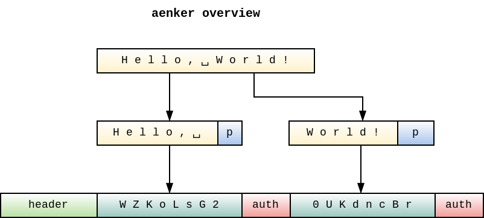

# aenker

`aenker` is a simple commandline utility to encrypt files to a public key ([Curve25519][0]) with an
authenticated encryption scheme ([ChaCha20Poly1305][1]). This is basically an [ECIES][2].

The input is split into smaller chunks internally and is encrypted & authenticated individually.
Padding and concatenation is done similarly to [InterMAC][3]. The key used for encryption is derived
with [HKDF][4] using [Blake2b][5] after performing anonymous Diffie-Hellman with a given public and
a random ephemeral private key. All this is further described in the
[specification](SPECIFICATION.md).

There is a small [decryption script](assets/decrypt.py) written in Python. It should provide an
easily readable overview of the inner workings.

[0]: https://cr.yp.to/ecdh.html
[1]: https://tools.ietf.org/html/rfc7539
[2]: https://en.wikipedia.org/wiki/Integrated_Encryption_Scheme
[3]: https://rwc.iacr.org/2018/Slides/Hansen.pdf
[4]: https://tools.ietf.org/html/rfc5869
[5]: https://blake2.net/

Authenticated encryption authenticates the ciphertext upon decryption and combined with the above
construction any chunk reordering, bit-flips or even truncation can be detected and are shown as
errors. Only ciphertext that has been successfully decrypted and authenticated is ever written to
the output. The chunking still alleviates the need to fit the entire file into memory at once or do
two passes over all data. Thus you can also encrypt files of many gigabytes.

## usage

First, you need a keypair. To generate a new random keypair use the builtin keygenerator:

    aenker kg -o ~/aenker.priv -p ~/aenker.pub

Send your **public** key `aenker.pub` to anyone who wants to encrypt data for you, keep your private
key .. well, private. **Note:** aenker only performs anonymous Diffie-Hellman and the keys are not
signed or certified. To protect against man-in-the-middle attacks you should transfer the key over a
secure channel or verify the integrity on a second channel.

Encrypt a simple message using the public key:

    echo 'Hello, World!' | aenker encrypt -p aenker.pub > message.ae

Decrypt it using the private key:

    aenker decrypt -k aenker.priv < message.ae

You can specify input and output files with `-i`/`-o` and use the aliases `seal`/`open` which are
commonly used with AEADs:

    aenker seal -i documents.tar -o documents.tar.ae -p recipient.pub
    aenker open -i documents.tar.ae -k mykey.sec | tar xf -

The key flags `-p`/`--peer` and `-k`/`--key` accept the base64-encoded keys on the commandline, too.
This is not safe for various reasons, so avoid using it for your private key.

    aenker seal -p lGLDUgFvp8TSwJ17VC9k0/T9mNWvfGoJ42zauMkAFBo=

### advanced key generation

Generally, Curve25519 - and thus aenker - accepts any 32 byte value as a key. You could generate a
private key by other means and then only calculate the public key to distribute it. You might just
read from system randomness:

    head -c32 /dev/urandom | base64 > privatekey
    aenker keygen pubkey -k privatekey > publickey

You could use a single private key and pass the `--symmetric` flag when encrypting. This will derive
the public key internally and proceed as usual but you will use the same key for decryption, which
effectively turns this into a symmetric encryption.

Or you could pass `--password` and use a password-based key derivation function compatible with
[ansemjo/stdkdf](https://github.com/ansemjo/stdkdf):

    stdkdf -salt aenker -cost hard | aenker kg pk > publickey
    aenker seal -p publickey -i message -o message.ae
    aenker open -i message.ae --password

Generate a password-based public key like above for distribution (both yield the same key):

    aenker keygen --password --salt mysalt
    stdkdf -salt mysalt -cost hard | curvekey pub

## installation

You can install from `master` with `go` (make sure `$GOPATH/bin/` is in your `$PATH`):

    go get -u github.com/ansemjo/aenker
    aenker --help

Or download a [release](https://github.com/ansemjo/aenker/releases) from GitHub and place it
somewhere in your `$PATH`.

### documentation

All of the commands output a nicely formatted help message, so you can use `--help` at any time:

    aenker encrypt --help

Furthermore, you can go to [docs/aenker.md](docs/aenker.md) if you're looking at this online or
install manpages with:

    aenker docs man -d ~/.local/share/man/
    man aenker-encrypt

### autocompletion

Completion scripts for your shell can be generated and sourced with:

     . <(aenker docs completion)

Or install the script globally with:

    aenker docs completion | sudo tee /usr/share/bash-completion/completions/aenker

### file detection

Append this in your `~/.magic` file:

    0 string aenker\xe7\x9e aenker encrypted file
    !:mime application/x-aenker

And `file` should detect encrypted files:

    file message
    message: aenker encrypted file
    xxd message | head -2
    00000000: 6165 6e6b 6572 e79e 42f7 5470 a191 973e  aenker..B.Tp...>
    00000010: dd2e 86ab 501e 9eea 6819 7249 9169 4229  ....P...h.rI.iB)

# disclaimer

    THE SOFTWARE IS PROVIDED "AS IS", WITHOUT WARRANTY OF ANY KIND, EXPRESS OR
    IMPLIED, INCLUDING BUT NOT LIMITED TO THE WARRANTIES OF MERCHANTABILITY,
    FITNESS FOR A PARTICULAR PURPOSE AND NONINFRINGEMENT. IN NO EVENT SHALL THE
    AUTHORS OR COPYRIGHT HOLDERS BE LIABLE FOR ANY CLAIM, DAMAGES OR OTHER
    LIABILITY, WHETHER IN AN ACTION OF CONTRACT, TORT OR OTHERWISE, ARISING FROM,
    OUT OF OR IN CONNECTION WITH THE SOFTWARE OR THE USE OR OTHER DEALINGS IN THE
    SOFTWARE.

Please be advised that I am not a professional cryptographer. This is merely a hobby of mine which I
hope can be useful to you.
