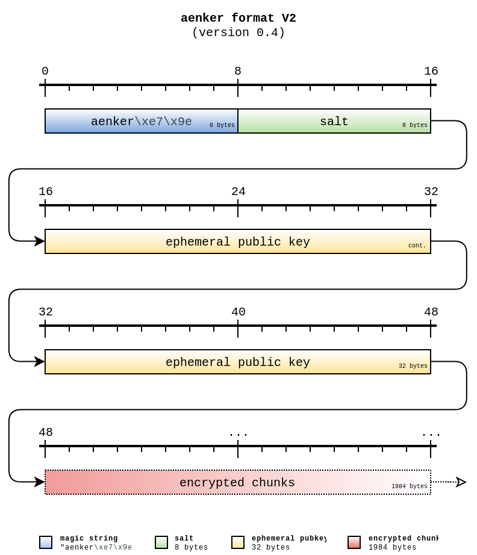

# Specification

## File Format

First of all, the on-disk format of a file encrypted with `aenker` looks like this:

The first eight bytes are 'magic bytes' to recognize files encrypted with aenker. The bytes
`\xe7\x9e` are the first two bytes of the Blake2b hash of the word 'aenker':

    >>> hashlib.blake2b(b'aenker').digest()[:2]
    b'\xe7\x9e'

The salt is randomly generated and is used in conjunction with the private part of the stored
ephemeral public key to derive the chunk encryption key.

## Chunking

The incoming plaintext is split into equal parts of length `chunksize`. To be more precise, it is
split into equal parts of length `chunksize-1` and is then [padded][godoc-padding] to the
full `chunksize` length.

Data is padded with either `\x00` or `\x01`, depending on the last byte of input data, and then a
marker byte is appended, which indicates whether this is a running chunk, a final chunk without padding
or a final chunk with padding.

[godoc-padding]: https://godoc.org/github.com/ansemjo/aenker/padding

| padding byte | if ...                           |
| ------------ | -------------------------------- |
| `\x01`       | last data byte is `\x00`         |
| `\x00`       | last data byte is **NOT** `\x00` |

| final byte | chunk type                                 |
| ---------- | ------------------------------------------ |
| `\x00`     | running chunk, at least one more following |
| `\x01`     | final chunk, no padding                    |
| `\x02`     | final chunk, padding was added             |

In the `aenker` commandline tool the chunksize is fixed at `1984`. This results in exactly 2 kB
ciphertext for small messages and padding and overhead losses approach < 1% for messages larger than
1 MB.

## Key Derivation

When encrypting to a recipient's public key, a random ephemeral private key is generated and
anonymous Diffie-Hellman is performed. The encryption key is then [derived][github-kdf] from
the resulting shared key with HKDF using unkeyed Blake2b-384, a random 8 byte salt and the info
string `aenker elliptic`:

[github-kdf]: https://github.com/ansemjo/aenker/blob/master/keyderivation/elliptic.go#L13

The ephemeral public key is calculated and then stored in the header, together with the random 8
byte salt.

## Encryption

Each chunk is [encrypted][github-cipherer] with [ChaCha20Poly1305][godoc-chacha] using a derived
key per message. Each chunk uses the same key, an incrementing nonce and the serialized file header
as [associated data][github-ae].

[github-cipherer]: https://github.com/ansemjo/aenker/blob/master/chunkstream/chunkcipherer.go
[godoc-chacha]: https://godoc.org/golang.org/x/crypto/chacha20poly1305
[github-ae]: https://github.com/ansemjo/aenker/blob/master/ae/aenker.go#L34

Naturally, the authentication tag adds some length to the encrypted data. You have to account for
that during decryption when reading the chunks back.

See the package [chunkstream][godoc-chunkstream] if you want
to use this chunked construction in your own application.

[godoc-chunkstream]: https://godoc.org/github.com/ansemjo/aenker/chunkstream

### Nonce Counter

The implementation can be seen in [noncecounter.go][github-noncecounter]. Basically, it is a
simple 64-bit incrementing counter which is encoded in LittleEndian into a 12 byte buffer:

    00 00 00 00 00 00 00 00 00 00 00 00
    01 00 00 00 00 00 00 00 00 00 00 00
    02 00 00 00 00 00 00 00 00 00 00 00
    03 00 00 00 00 00 00 00 00 00 00 00
    ...

Due to the use of this simple nonce construction, the nonce need not be saved seperately but it
REQUIRES that a unique key is used for every message. Otherwise message integrity and confidentiality
could be broken. Hence, an ephemeral keypair is used.

[github-noncecounter]: https://github.com/ansemjo/aenker/blob/master/chunkstream/noncecounter.go
